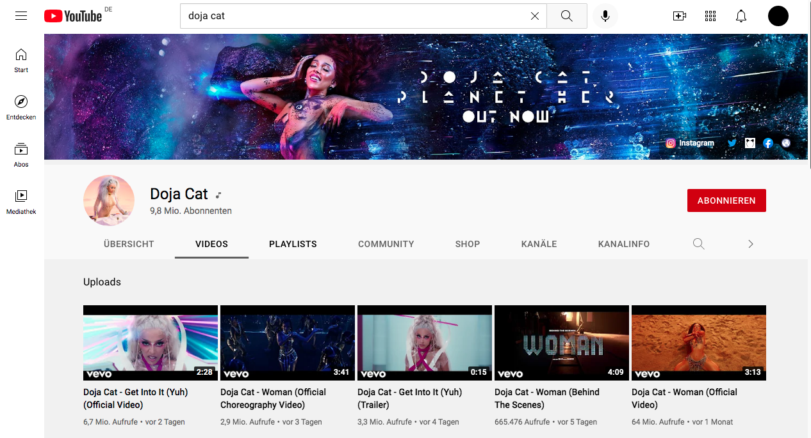

## YouTube CLone

**[Test this app yourself](justiankober.github.io/youtube-clone/)**

---

#### Navigation

- About Project
  - _Description_
  - _Developed With_
- How to use this Project
  - _Description_
  - _Developed With_
- Contact
  - _Mail_
  - _GitHub_
  - _LinkedIn_
- Used Tools
  - _Fonts_
  - _Design_
  - _Icons_
  - _Colors_

---

### About Project

This is an YouTube Clone Web Application to practice.

### How to use this Project

Just look @ the link and see the result.

##### Developed With

- [x] _HTML5_
- [x] _CSS3_
- [ ] _SASS_
- [ ] _SCSS_
- [ ] _JavaScript_
- [ ] _React_
- [ ] _Bootstrap_
- [ ] _npm_
- [ ] _..._

---

### Contact

Mail: <Justian.Kober@icloud.com> 
GitHub: [justiankober](https://github.com/justiankober) 
LinkedIn: [justiankober](https://www.linkedin.com/in/justian-kober-8a1281132/)

---

### Used Tools

- [icons](https://unpkg.com)
- [Canva](https://www.canva.com/)
- [npm](https://www.npmjs.com/)
- [Google Fonts](https://fonts.google.com/)
- [Visual Studio Code](https://code.visualstudio.com/)
- [ColorZilla](https://www.colorzilla.com/chrome/)

---
